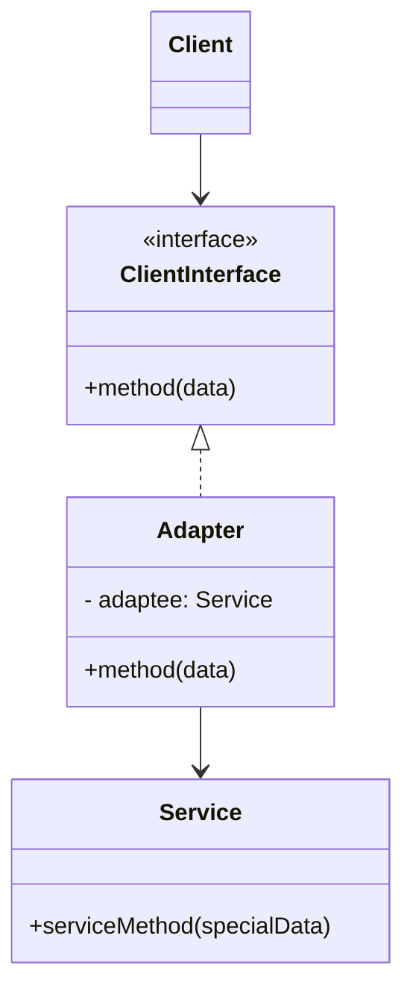
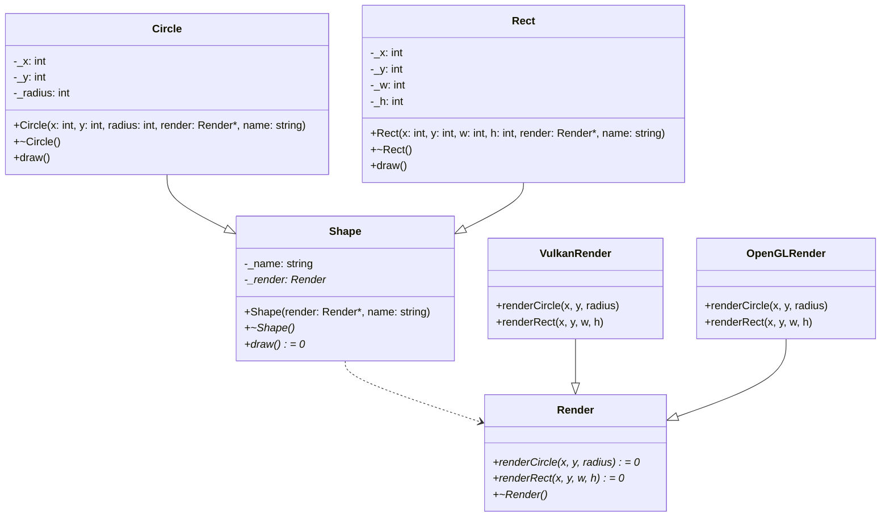
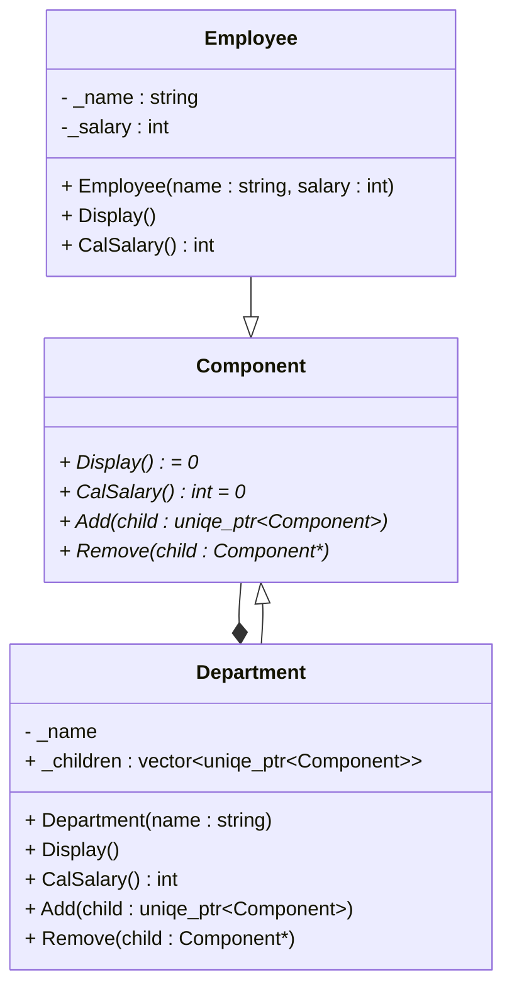
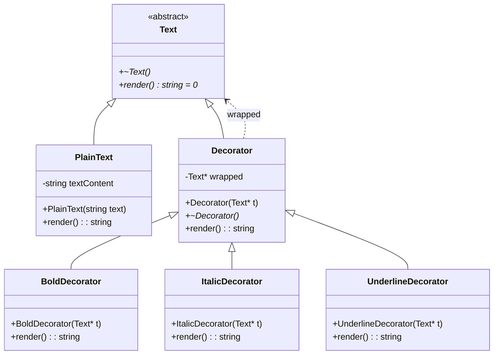
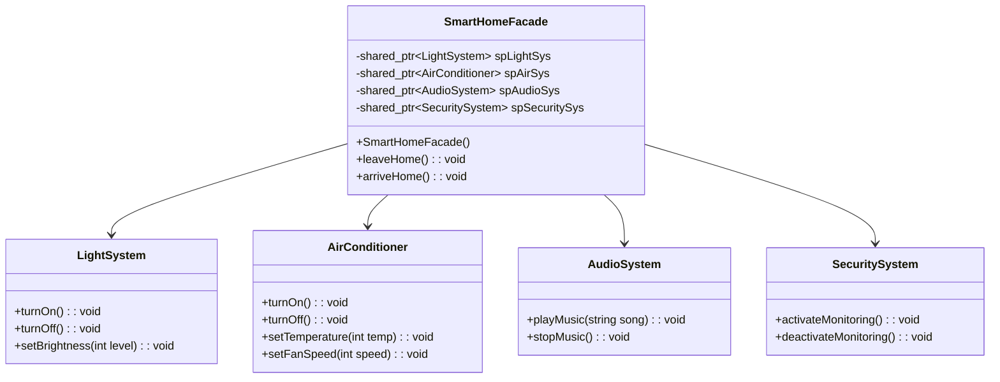
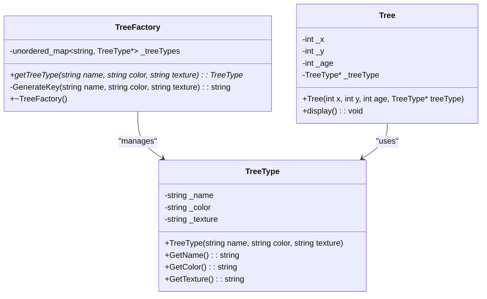
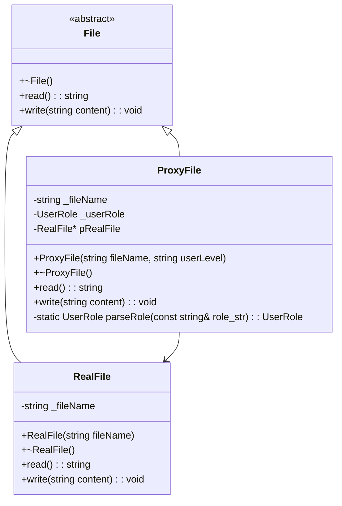

# 创建型模式

# 结构型模式

## 适配器模式(Adapter)

### 应用场景
类似于生活中的电源适配器，转换输出电压，使电器正常工作。  
上游程序的输出无法满足下游程序输入，并且上游程序无法修改。通过适配器封装上游程序，对上游程序的输出进行调整，提供能被下游程序调用的接口，实现兼容。

### 实现方式
- 适配器中包含被适配的对象
- 适配器中提供能被下游程序调用的接口

### 编程练习

**背景**  
某公司需要将旧版​​XML数据解析器​​整合到新系统中，但新系统要求统一使用​​JSON格式接口​​。旧版解析器的核心方法为parseXML()，它会返回XML格式的字符串，而新系统需要调用getJSONData()来获取JSON数据。请你使用适配器模式解决接口不兼容问题。  
**要求**​​  
1. 定义目标接口 JSONParser，包含纯虚函数 getJSONData()。
2. 实现被适配的旧类 LegacyXMLParser，其方法 parseXML() 返回固定XML字符串。
3. 编写适配器类 XMLToJSONAdapter，将 parseXML() 的结果转换为JSON格式。
4. 在 main 函数中演示适配器的工作流程。

**C++实现**  
[点击跳转](./design_pattern_excercise/structural_patterns/adapter/adapter_firstAns.cpp)

## 桥接模式(Bridge)

### 应用场景
有一系列的类，这些类可以划分为`抽象(接口)`和`实现(平台)`两部分。使用桥接模式，可以减少类的数量，拥有更好的可扩展性。常见的例子是GUI程序和底层接口实现，
为了实现跨平台，需要适配多个平台的底层接口  

### 实现方式
- 抽象部分依赖于实现部分（桥接）  
- 抽象部分和实现部分通过定义抽象基类实现多态
- 桥接模式中的抽象部分和实现部分，和编程语言中的抽象没有任何关系，仅表示层次关系  

### 编程练习
**背景**  
你需要设计一个跨平台的图形渲染系统，支持不同的​​图形类型​​（如圆形、矩形）和不同的​​渲染API​​（如OpenGL、Vulkan）。使用​​桥接模式​​将图形与渲染实现解耦，确保二者能独立扩展。  
**要求**​​  
​1. ​实现以下类结构​​：  
- ​抽象化类​​ `Shape`：
属性：名称（如Circle）  
方法：virtual void draw() = 0  
持有对Renderer接口的引用  
- ​扩展抽象化类​​ `Circle` 和 `Rectangle`：  
继承自Shape  
实现具体的draw()方法，委托给Renderer接口  
​​实现化接口​​ Renderer：  
方法：virtual void renderCircle(int x, int y, int r) = 0  
virtual void renderRect(int x, int y, int w, int h) = 0  
- 具体实现化类​​ `OpenGLRenderer` 和 `VulkanRenderer`：  
实现Renderer接口，打印不同的渲染信息    

​2. ​客户端代码​​：  
- 创建不同图形与渲染API的组合（如Circle + Vulkan）  
- 调用draw()方法，输出类似：  
Vulkan渲染圆形：位置(10, 20), 半径 5  
OpenGL渲染矩形：位置(30, 40), 宽 8, 高 6  

**C++实现**  
[点击跳转](./design_pattern_excercise/structural_patterns/bridge/bridge_adjustedAns.cpp)  
**C++编程小知识**  
- 构造函数使用初始化列表初始化和函数体内赋值初始化的区别  
    1. 初始化列表更快。初始化列表调用对象的带参构造函数，一步到位；赋值初始化会先调用对象的默认构造函数，然后调用拷贝操作符，需要两步操作
    2. 对于const对象和引用成员，只能被绑定一次，不能对其赋值，只能使用列表初始化
    3. 对于没有默认构造函数的父类，必须在列表初始化中显式地调用父类带参构造函数
- 虚析构必须显式声明析构函数=default，因为默认生成的析构函数不是虚的

## 组合模式(Composite)

### 应用场景
- 业务场景包含树状结构（公司部门管理）
- 客户端需要用相同的接口访问简单元素和复杂元素

### 实现方式
- 实现`简单叶节点类`和`复杂容器类`，他们继承于`组合组件类`
- `复杂容器类`包含一个数组成员变量，用于存储其管理的对象(容器/叶节点)
- 客户端需要调用的接口尽量放在`组合组件类`中，确保对叶节点和容器都有意义。实现方法的时候利用树状结构的递归特性  

### 编程练习
**背景**  
假设你需要设计一个系统来表示公司的部门结构，并计算整个公司的总薪资。每个部门可以包含​​员工​​（叶子节点）和​​子部门​​（容器节点），形成树形结构。使用组合模式实现以下功能：  
1. 计算部门总薪资​​：每个员工有固定薪资，部门的总薪资是其所有员工和子部门薪资的总和。  
2. ​显示部门结构​​：以树形格式输出部门层级（例如：- 部门A、--- 员工张三）。  

**要求**​​   
1. 定义抽象组件类 DepartmentComponent，包含以下方法：  
virtual int calculateSalary() = 0：计算薪资。  
virtual void display(int depth = 0)：显示层级结构（depth 表示缩进层级）。  
virtual void add(std::unique_ptr<DepartmentComponent> component)：添加子组件。  
virtual void remove(DepartmentComponent* component)：移除子组件。  
2. 实现叶子节点类 Employee：  
构造函数接受员工姓名和薪资。  
calculateSalary() 返回员工薪资。  
display() 输出员工信息（例如：--- 员工张三）。  
3. 实现容器节点类 Department：  
构造函数接受部门名称。  
calculateSalary() 返回部门及其子组件的总薪资。  
display() 递归输出部门及其子组件的层级。  
管理子组件集合（使用 std::vector<std::unique_ptr<DepartmentComponent>>）。  
**C++实现**  
[点击跳转](./design_pattern_excercise/structural_patterns/composite/composite_adjustedAns.cpp)  
**C++编程小知识**   
 - `remove_if`函数并不会直接删除元素，而是会把符合条件的元素放到容器的末尾，最后反馈的迭代器指向第一个符合删除条件的元素，
 - 需要配合erase才能真正删除元素
 - string(3, "-")可以构造出三个小短横的字符串  

## 装饰模式(Decorator/Wrapper)

### 应用场景
- 需要在运行时扩展对象的行为
- 使用继承方式扩展对象行为难以实现或无法实现

### 实现方式
1. 确保业务逻辑可用一个`基本组件`及多个额外`可选层次`表示。  
2. 找出`基本组件`和`可选层次`的通用方法。 创建一个`组件接口`并在其中声明这些方法。  
3. 创建一个`基本组件`类。  
4. 创建`装饰基类`， **使用一个成员变量存储指向被封装对象的引用**。 该成员变量必须被声明为组件接口类型， 从而能在运行时连接具体组件和装饰。装饰基类必须将所有工作委派给被封装的对象。  
5. 将装饰基类扩展为`具体装饰`。具体装饰必须在调用父类方法 （总是委派给被封装对象） 之前或之后执行自身的行为。  
6. 客户端代码负责创建装饰并将其组合成客户端所需的形式。

### 编程练习
**背景**  
模拟文本的动态格式化功能  
**要求**​​ 
1. ​组件基类​​：定义抽象类 Text，包含纯虚函数 std::string render()。  
2. ​具体组件​​：实现 PlainText 类，构造时接收字符串，render() 返回原始文本。 
3. ​装饰器基类​​：定义 TextDecorator 类，继承 Text，包含 Text* 成员变  量，通过组合实现装饰功能。  
4. ​具体装饰器​​：  
BoldDecorator：在文本前后添加 `<b>` 和 `</b>`。
ItalicDecorator：在文本前后添加 `<i>` 和 `</i>`。
UnderlineDecorator：在文本前后添加 `<u>` 和 `</u>`。  

**C++实现**  
[点击跳转](./design_pattern_excercise/structural_patterns/decorator/decorator_adjustedAns.cpp)  
**C++编程小知识** 
- 编译器不会生成默认移动构造函数(/移动赋值操作符)的情况：  
类中​​显式声明了析构函数或拷贝控制成员​(拷贝构造函数/拷贝赋值操作符)
- 编译器不会生成默认拷贝构造函数(/拷贝赋值操作符)的情况：  
类中​​显式声明了析构函数或移动控制成员​(移动构造函数/移动赋值操作符)  
- 根据C++11及后续标准，当用户声明了移动/拷贝构造函数、移动/拷贝赋值运算符、析构函数中的任意一个时，编译器会认为该类需要进行特殊的资源管理，从而​​不再自动生成默认的拷贝/移动构造函数和拷贝/移动赋值运算符​​。  
这一行为是为了避免隐式生成的浅拷贝操作可能导致的资源管理错误（如重复释放）。

## 外观模式(Facade)

### 应用场景
- 客户端依赖于多个复杂子系统，但是只用了子系统的部分功能，客户端希望简化调用和复杂子系统解耦
- 简化依赖：客户端不必关心子系统的实现细节
- 解耦：子系统的变化不会影响客户端，只需要调整外观即可

### 实现方式
创建一个外观类，外观类中维护了子系统对象，并给客户端提供用于操作这些子对象的接口

### 编程练习
**背景**  
设计一个​智能家居控制系统​​，该系统包含多个设备（子系统）：  ​​
- 灯光系统​​：控制房间的灯光亮度。  
- 空调系统​​：调节温度和风速。
- 音响系统​​：播放或停止音乐。​​
- 安全系统​​：监控门窗状态。  

**要求**​​  
请使用 ​​外观模式​​ 设计一个统一接口`SmartHomeFacade`，实现以下功能：
- ​回家模式​​：自动开启灯光、设置空调温度、播放欢迎音乐，并关闭安全监控。
- 离家模式​​：自动关闭所有灯光和空调，停止音乐，并启动安全监控。
要求客户端代码仅通过`SmartHomeFacade`与系统交互，​​不能直接调用子系统的接口​​。  

**C++实现**  
[点击跳转](./design_pattern_excercise/structural_patterns/facade/facade_firstAns.cpp)  
**C++编程小知识**  
题目未要求子系统对象动态创建，可直接将子系统对象作为 SmartHomeFacade 的普通成员变量，
无需使用 shared_ptr。非要用智能指针的话，unique_ptr也比shared_ptr好。
子系统对象的创建和销毁完全由 SmartHomeFacade 控制，无需共享。  
相比于shared_ptr，unique_ptr性能更好，无额外开销，仅包装原始指针

## 享元模式(Flyweight)

### 应用场景
多个对象需要保存相同的静态数据，希望减少这些对象的内存占用

### 实现方式
- 抽取出对象共有的静态数据，将其封装为一个享元类
- 需要共享静态数据的对象中维护一个指针变量，用于存储享元类
- 最好搭配享元工厂类使用，工厂类中存储了已经实例化出的享元类对象

### 编程练习
**背景**  
设计一个简单的​​游戏树渲染系统​​，其中每棵树（Tree）包含以下属性：
- ​内部状态（可共享）​​：树的类型名称（如“橡树”“松树”）、基础颜色、纹理数据。
- ​外部状态（不可共享）​​：树的坐标（x, y）、年龄。
要求使用​​享元模式​​实现以下功能：
- 创建享元工厂`TreeFactory`，管理不同类型的树（内部状态），确保相同类型的树共享同一对象。
- 实现 Tree 类，包含外部状态（坐标、年龄）并引用享元对象（内部状态）。
- 在客户端代码中创建多棵树，验证相同类型的树是否共享实例。

**要求**​
- 定义`TreeType`类作为享元，包含内部状态：name（类型名称）、color（颜色）、texture（纹理）。
- 定义 Tree 类，包含外部状态：x, y（坐标）、age（年龄），并持有`TreeType`的指针。
- 实现 TreeFactory 类，通过 std::unordered_map 缓存已创建的`TreeType`对象。
- 编写客户端代码，创建至少 ​​3 棵同类型树​​和 ​​1 棵不同类型树​​，输出它们的内部状态地址，验证共享是否生效。​ 

**C++实现**  
[点击跳转](./design_pattern_excercise/structural_patterns/flyWeight/flyWeight_adjustedAns.cpp)  
**C++编程小知识**  
- 如果类的函数不应该修改类的成员，这个函数最好定义为常成员函数，确保能被const对象调用。比如：TreeType的GetName、GetColoar、GetTexture方法

## 代理模式(Proxy)

### 应用场景
- 延迟加载 对于资源密集型对象，在真正使用的时候再加载（构造以及各种操作）。将延迟加载代码放到代理类中，可以避免重复代码，
并且对于客户端来说，访问代理和访问真实对象是一样的，都是调用相同的访问接口
- 访问控制 在访问真实对象前后执行一些操作，例如权限控制

### 实现方式
1. 定义真实对象的类（被代理）
2. 定义代理类，代理中维护了真实对象的指针
3. 定义真实对象类和代理类的抽象基类，确保真实对象和代理类对象能够通过相同的接口进行访问

### 编程练习
**背景**  
设计一个代理类，控制对敏感文件的读写操作。具体要求如下：
- ​文件接口​​`File`：声明纯虚函数 read() 和 write(const string& content)。
- ​真实文件类​​`RealFile`：实现 File 接口，直接读写文件内容。
- ​代理类​​`ProxyFile`：实现 File 接口，在调用 read()/write() 前检查用户权限：
- 管理员（admin）可读写
- 普通用户（user）只能读
- 其他用户拒绝访问
- ​客户端​​：通过代理对象操作文件，验证权限逻辑。

**要求**​​ 
- 文件接口`File`包含虚析构函数
- `RealFile`构造函数接收文件名，read() 返回固定字符串 "File Content"，write() 打印写入内容
- `ProxyFile`构造函数接收文件名和用户角色（admin/user/其他）
非法操作时抛出 runtime_error 异常 

**C++实现**  
[点击跳转](./design_pattern_excercise/structural_patterns/proxy/proxy_adjustedAns.cpp)  
**C++编程小知识**  

## XXX模式(XXX)

### 应用场景

### 实现方式

### 编程练习
**背景**  
**要求**​​  
**C++实现**  
[点击跳转](./design_pattern_excercise/structural_patterns)  
**C++编程小知识**  

# 行为模式

# 参考资料

https://subingwen.cn/design-patterns/

https://refactoringguru.cn/design-patterns/